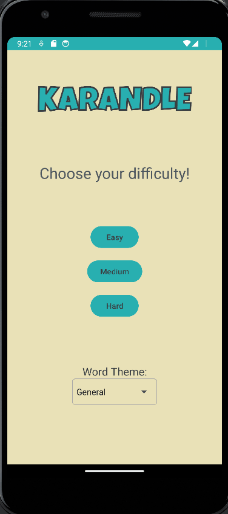

# Android Project 1 - *Karandle*

Submitted by: **Karan Komal**

**Karandle** is an Android app that recreates a simple version of the popular word game [Wordle](https://www.nytimes.com/games/wordle/index.html). 

Time spent: **8** hours spent in total

## Required Features

The following **required** functionality is completed:

- [X] **User has 3 chances to guess a random 4 letter word**
- [X] **After 3 guesses, user should no longer be able to submit another guess**
- [X] **After each guess, user sees the "correctness" of the guess**
- [X] **After all guesses are taken, user can see the target word displayed**

The following **optional** features are implemented:

- [X] User can toggle betweeen different word lists
- [X] User can see the 'correctness' of their guess through colors on the word 
- [X] User sees a visual change after guessing the correct word
- [ ] User can tap a 'Reset' button to get a new word and clear previous guesses
- [ ] User will get an error message if they input an invalid guess
- [ ] User can see a 'streak' record of how many words they've guessed correctly.

The following **additional** features are implemented:

- [X] User can choose one of three difficulties for the game.
  * Easy difficulty allows the user 5 guesses.
  * Medium difficulty allows the user 4 guesses.
  * Hard difficulty allows the user 3 guesses.
- [X] User can easily play again once they either guess correctly or use up all of their chances by pressing the "Try Again" button.
- [X] Quality of life addition: User input is locked to valid characters only, meaning they cannot put in extraneous characters
- [X] Quality of life addition: A guess can either be submitted through the "Guess!" button, or by pressing Enter on the keyboard.

## Video Walkthrough

Here's a walkthrough of implemented user stories:

<!-- Replace this with whatever GIF tool you used! -->
GIF created with [ScreenToGif](https://www.screentogif.com/) for Windows  
<!-- Recommended tools:
[Kap](https://getkap.co/) for macOS
[ScreenToGif](https://www.screentogif.com/) for Windows
[peek](https://github.com/phw/peek) for Linux. -->

## Notes

### **Describe any challenges encountered while building the app:**

The biggest challenges definitely came from making the EditText boxes work smoothly. There are 20(!) EditText boxes were used all through the guessing process, so managing them was a bit of a pain. Also, figuring out how to make the cursor move from one box to the next was a hassle. Additionally, making sure the backspace worked properly (the cursor goes back to the previous box) for the boxes was also a hassle. Beyond that, it was mostly just an issue of figuring out how certain things work, such as the spinner drop-down box. 

## License

    Copyright 2023 Karan Komal

    Licensed under the Apache License, Version 2.0 (the "License");
    you may not use this file except in compliance with the License.
    You may obtain a copy of the License at

        http://www.apache.org/licenses/LICENSE-2.0

    Unless required by applicable law or agreed to in writing, software
    distributed under the License is distributed on an "AS IS" BASIS,
    WITHOUT WARRANTIES OR CONDITIONS OF ANY KIND, either express or implied.
    See the License for the specific language governing permissions and
    limitations under the License.
